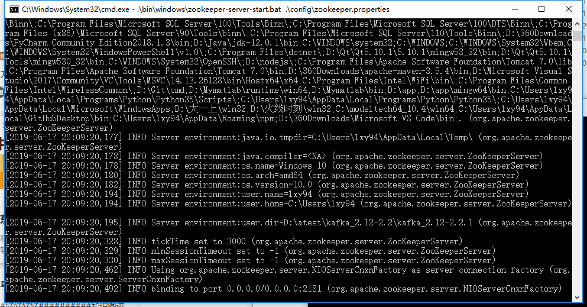
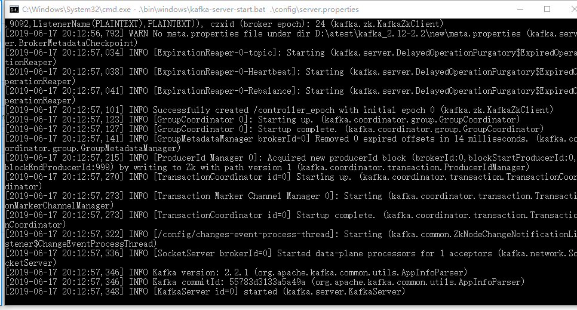
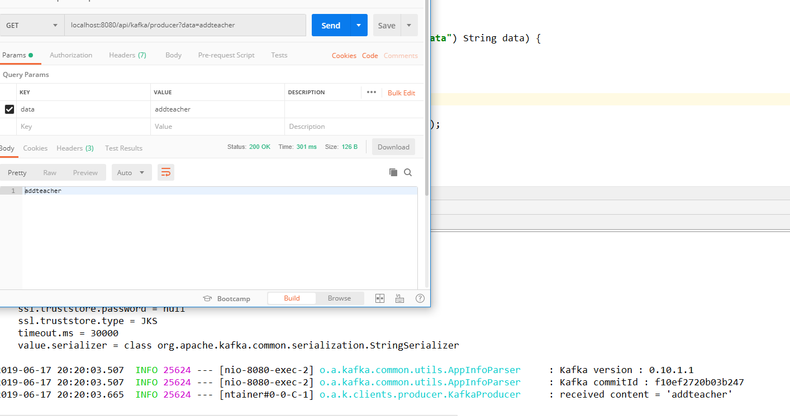
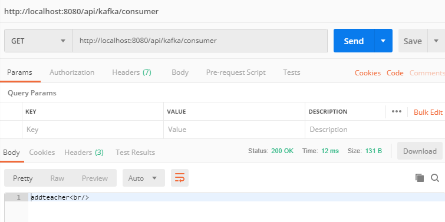

# Readme

##Group Members
16301095 李星原
16301099 莫日根呼

启动zookeeper



启动kafka




kafkaconsumer

```java
@Component
public class KafkaConsumer {

    private static final Logger log = LoggerFactory.getLogger(KafkaProducer.class);

    @Autowired
    private MessageStorage storage;

    @KafkaListener(topics = "${api.kafka.topic}")
    public void processMessage(String content) {
        log.info("received content = '{}'", content);
        storage.put(content);
    }

}
```



kafkaproducer

```java
@Service
public class KafkaProducer {

    private static final Logger log = LoggerFactory.getLogger(KafkaProducer.class);
    
    @Autowired
    private KafkaTemplate<String, String> kafkaTemplate;
    
    @Value("${api.kafka.topic}")
    String kafkaTopic = "api-kafka-topic";
    
    public void send(String data) {
        log.info("sending data='{}'", data);
        kafkaTemplate.send(kafkaTopic, data);
    }

}
```


